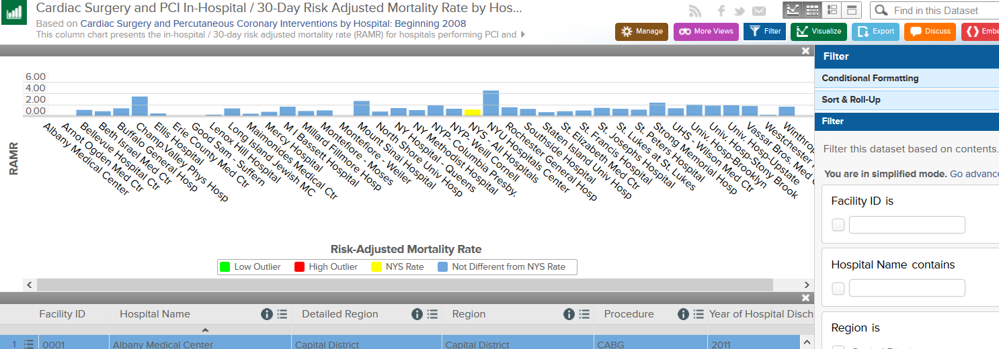

## Why bother?

* Open health data is publicly available
* Goal: empower patients, hold providers accountable
* Published data can be difficult to interpret (patients AND providers)

---

## Goal: Increase access

* Ease of use = better access for patients
* Raw data is uninterpretable for the average patient
* The government-provided interface offers tons of options which can be overwhelming

---

## Therefore, we present:

... drumroll...

### pick_CABG_hospital

* Ease of use: Just pick the hospital that you are interested in.
* Compare: See where that hospital's performance relative to the overall distribution
* References listed to the original dataset

--- &radio

## Quiz

What is the main reason for the publication of the pick_CABG_hospital project?

1. Flatter the hospitals who are doing well.

2. Show which hospitals are underperforming.

3. _Increase access for patients to publicly available performance data._

4. Prove that shiny actually works.

*** .hint
Try again.

*** .explanation
The goal of the pick_CABG_hospital app is to lower the threshold for patients to make use of publicly available data and to increase access.
